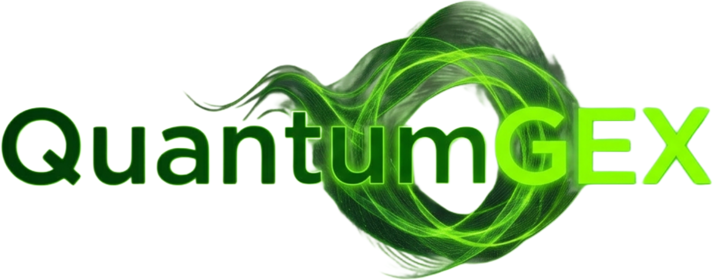
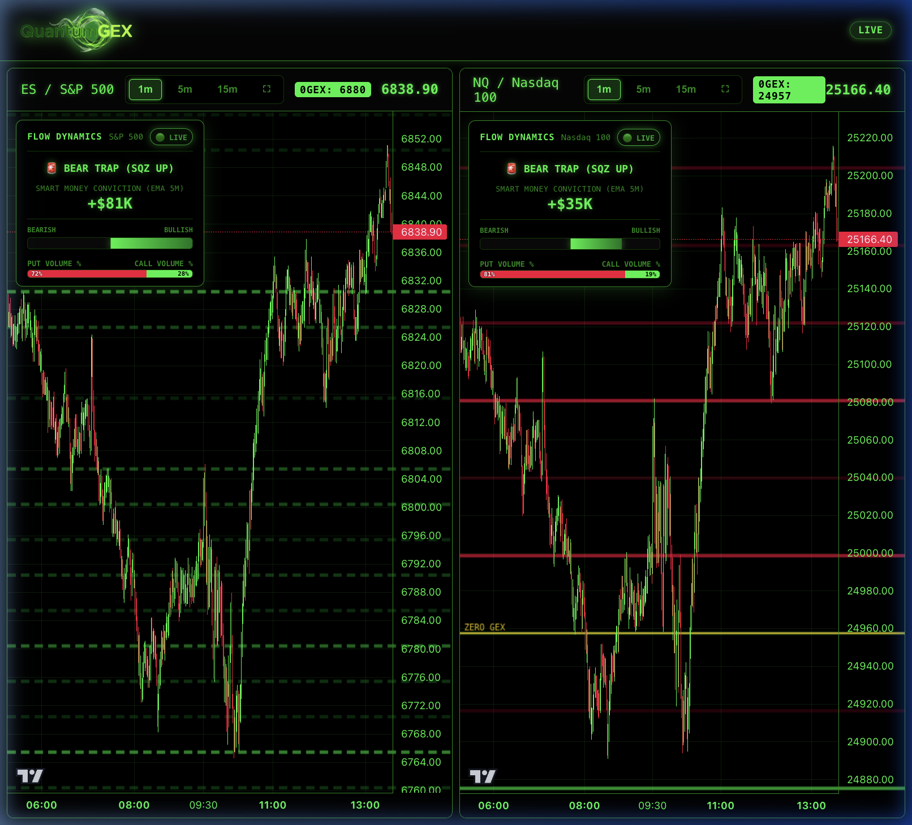
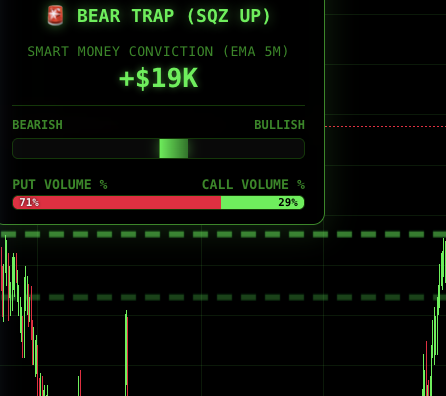

  
  <h1>User Guide: QuantumGEX v4.0</h1>
  
<i>The advanced system for real-time monitoring of Gamma Exposure (GEX) and Smart Money flows</i>

---

## 1. System Overview

**QuantumGEX** provides an institutional magnifying glass on the real market structure. By analyzing in real-time the positioning of Market Makers (Dealers), the platform reveals where the true support and resistance levels lie for major markets:
* **S&P 500** (ES Futures / SPX Underlying)
* **NASDAQ 100** (NQ Futures / QQQ Underlying)

All data is processed in **continuous stream**, blending millisecond futures pricing via cTrader with the massive and complex 0DTE options chain data via Tradier API.

---

## 2. Main Interface and "Lightsabers" (GEX)

The main interface fuses price action directly with Market Maker Gamma exposure, drawing the iconic "*Lightsabers*" (horizontal levels) exactly where Dealers have set up their protective barriers.

  
  
<i>Figure 1: Main screen of QuantumGEX showing the Gamma Flip (Yellow Line) and GEX barriers (Red/Green).</i>

### 2.1 The Yellow Line: The "Gamma Flip" (Zero GEX)
The most critical level visible on the screen is the **thick and bright Yellow line** (marked with the `0GEX: [Price]` label in the header).
This is the market's **structural watershed**: the mathematical point where the Dealers' net exposure shifts from being positive (Mean Reverting) to negative (High Volatility).

* **Price > Yellow Line (Positive Gamma)**: The market is "dense" and stable. Dealers sell rallies and buy dips to hedge. **Levels tend to hold**.
* **Price < Yellow Line (Negative Gamma)**: The market is in structural "panic." Dealers are forced to sell when the market drops and buy when it rallies. **Levels become fragile or directional magnets**.

### 2.2 Support and Resistance Levels (The Colors)
The luminous intensity (opacity) is proportional to the level's importance (GEX Size). The color and style of the line have precise operational meaning:

* 🔴 **Red Lines (Call GEX - Resistances)**: Call contracts are clustered here.
* 🟢 **Green Lines (Put GEX - Supports)**: Put contracts are clustered here.

### 2.3 Line Style (The Context)
To allow you to evaluate the *robustness* of these levels instantly, QuantumGEX adapts the line style based on where the price is relative to the Gamma Flip:

* ➖ **Solid Lines**: Appear when the price is in the Positive Gamma zone. They indicate a **Concrete Wall**. These levels offer excellent probabilities of rejecting the price and causing bounces (structural mean-reversion).
* 🧻 **Dashed Lines**: Appear when the price is in the Negative Gamma zone. They indicate a **Drywall** or a "Magnet." High volatility can break these levels easily, accelerating the trend rather than stopping it.

---

## 3. The Smart Money Box (Power Meter)

The *Smart Money Box* panel translates the devastating and chaotic options order flow into a clear indicator of institutional conviction at that precise moment.

  
  
<i>Figure 2: The Smart Money Box featuring Call/Put divergence visualization.</i>

### 3.1 Net Drift EMA 5m (The "Absolute Boss")
The beating heart of the Power Meter is the central green/red dial: the **Smart Money Conviction**.
* Calculated via a **5-minute EMA (Exponential Moving Average)**, it rewards urgent market "Sweeps" and massive trades near the Spot price, while heavily discounting gigantic but neutral Block Trades.
* **Color Signal**: If the needle is on the green side and the value is positive (+XX K), institutional capital is actively pushing (Drifting) the market upward.

### 3.2 Dual Bars (Volume vs Premium) and "Trap" Signals
Below the Conviction EMA, you will find two percentage bars:
- **Premium Bar**: (The true Smart Money) Indicates who is spending more real Dollars (Calls or Puts).
- **Volume Bar**: (The Swarm/Retail) Indicates on which front more paper is being traded (raw contracts).

The textual display at the top merges the EMA with these bars to provide not only the trend direction (`STRONG CALL/PUT TREND`), but also warnings about anomalous behaviors (Divergences and Traps):

* 🚨 **BEAR TRAP (SQZ UP)**: SPX is rising (EMA Bullish), Puts have high volume (Retail is scared or covering shorts), but the real market is being bought. Great moment for long squeezes.
* 🚨 **BULL TRAP (DUMP)**: SPX is dropping (EMA Bearish), Retail is desperately buying Calls hoping for a bottom, but big players are dumping. Imminent crash.
* ⚠️ **VOL / DRIFT DIV**: Clear disagreement between heavy hitter spending (flat or opposite Drift) and mere volume traffic. Time to stay on the sidelines.
* ⚪ **NEUTRAL DRIFT**: Negligible net volumes (< $10,000). Lack of algorithmic push, just background noise.

### 3.3 Advanced Algorithmic Filters (QuantData Inspired)
To ensure the highest quality signal detection, QuantumGEX automatically filters the live options flow to ignore "noise" and highlight true conviction:
- **Block Trade Discounting**: Massive block trades (e.g., >200 contracts) are mathematically curbed (logarithmic dampening) to prevent simple hedging routines from creating false trend signals.
- **Spread Neutrality**: If the Bid/Ask spread is excessively wide (>$0.50), trades executing near the mid-price are entirely filtered out.
- **Spot Distance & Urgency Multipliers**: Trades filled at the exact Ask or Bid receive an "Urgency Multiplier." Furthermore, trades closer to the underlying spot price (ATM/ITM) are weighted more heavily than distant (Deep OTM) speculative trades.

---

## 4. Troubleshooting (FAQ)

* **The Smart Money panel disappears or gets stuck on "Offline"?**
  If no ticks pass for 60 seconds (during market hours), the app goes into protection mode to avoid showing stale signals. Simply refresh the page (F5).
* **Can I move the panels?**
  Yes! Click and drag the Smart Money box wherever it's most convenient for you on the chart.
* **How do I read the zero GEX on Nasdaq?**
  Unlike the SPX, the QQQ is often monstrously skewed toward Puts. QuantumGEX's logic engine uses the "*Gamma Valley*" underlying algorithm to mathematically find the exact point of the Flip without false alarms, giving you a reliable ruler.
